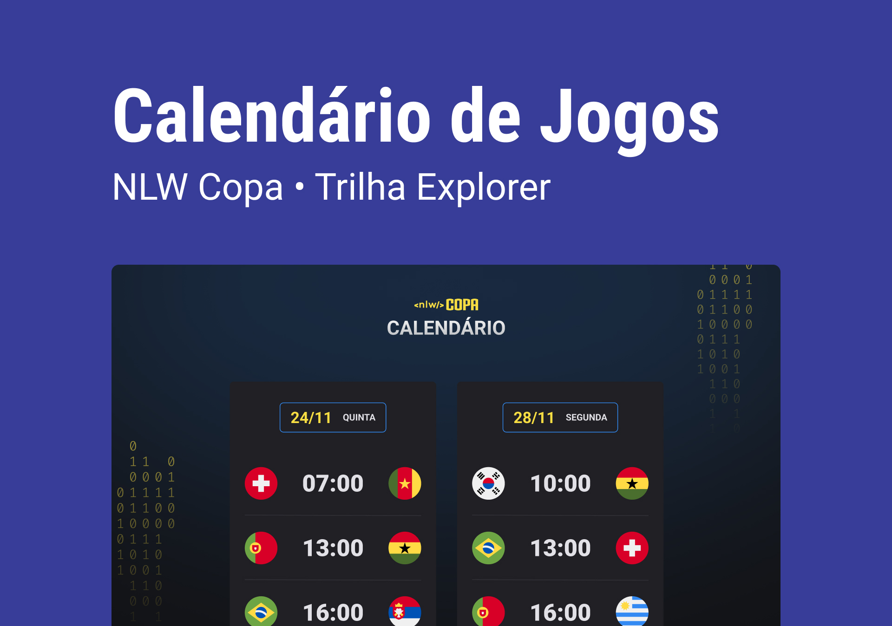

<h1 align="center> NLW #10 Copa </h1>

Evento exclusivo e gratuito, promovido pela rocketseat para ensiino de tecnologias WEB.

  <a href="#-tecnologias">Tecnologias</a>&nbsp;&nbsp;&nbsp;|&nbsp;&nbsp;&nbsp;
  <a href="#-projeto">Projeto</a>&nbsp;&nbsp;&nbsp;|&nbsp;&nbsp;&nbsp;
  <a href="#-layout">Layout</a>&nbsp;&nbsp;&nbsp;|&nbsp;&nbsp;&nbsp;
  <a href="#memo-licença">Licença</a>

   src="https://img.shields.io/static/v1?label=license&message=MIT&color=49AA26&labelColor=000000">

 

  

## 🚀 Tecnologias

- HTML e CSS
- JavaScript
- Git e Github

## 💻 Projeto

O projeto Copa é um calendário de jogos da copa do mundo de 2022, onde é possível ver as datas e horários dos jogos, e também os grupos e seleções participantes.

## 🔖 Layout

Você pode visualizar o layout do projeto através [Desse Link](https://www.figma.com/file/cMzILphKzz7zbLE1g5le8I/Calend%C3%A1rio-de-Jogos-(Community)). É necessário ter conta no [Figma](http://figma.com/) para acessá-lo

## :memo: Licença

Esse projeto está sob a licença MIT.

Feito com ♥ by [Rocketseat](https://rocketseat.com.br) e [Victor Matheus]